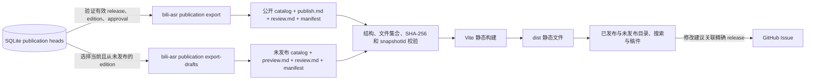

# Markdown 稿件阅读站

独立静态站点，展示主项目中正式发布的有效 release，以及明确标注审核状态的当前未发布编辑版本。
浏览器读取各自快照中的公开正文、AI 初稿的校验参照稿和读者元数据；SQLite、独立 AI 合成稿及内部事件留在主项目。

仓库初始保留两份合法空快照；本地联调使用的合成稿件不会作为正式内容提交。

## 产品定位与改动依据

项目面向长视频与系列讲解内容的学习者，提供可搜索、可连续阅读、可回看来源的文字资料库，服务阅读、查找、复习与核验。

后续功能、界面、内容组织和技术选型以 [项目哲学与产品原则](docs/product-philosophy.md) 为产品依据；仓库协作要求见 [AGENTS.md](AGENTS.md)。该文档记录长期目标与取舍，功能方向不代表已经实现；当前内容契约与运行方式以本 README 和代码为准。

## 架构



## 本地运行

需要 Node.js 20 或更新版本及 pnpm：

```powershell
pnpm install --frozen-lockfile
pnpm dev
```

默认地址为 `http://127.0.0.1:5173`。开发服务器启动及生产构建均校验两份公开快照。
仓库初始快照是合法空目录，查看未发布稿件不会产生审核或正式发布事实。

## 导入已发布稿

先在 `bilibili-asr-archive` 中按新稿件契约创建 edition、审核准确内容哈希并显式发布，然后导出：

```powershell
bili-asr publication export --archive-root C:\Archive\new-contract --out C:\Sites\markdown-reading-site\content
```

输出目录必须与源归档及产物根互不重叠。命令读取有效发布指针，只导出当前 release 的
`publish.md` 及该编辑版本对应 AI 修订的原始 `review.md`；创建 B 草稿或批准未发布的 B 时，
公开目录继续呈现 A。明确发布 B 后切换 B，
撤回当前版本后该分 P 从新快照中移除。审核与编辑命令详见主项目
[publication.md](https://github.com/SuperCatQR/bilibili-asr-archive/blob/main/docs/publication.md)。
后端契约实现与审核流程见 [主项目 PR #264](https://github.com/SuperCatQR/bilibili-asr-archive/pull/264)。
公开未发布预览的后端导出实现见 [主项目 PR #265](https://github.com/SuperCatQR/bilibili-asr-archive/pull/265)。

本仓库只接受新契约：

```text
content/
  catalog.json
  publication-export-manifest.json
  articles/part-<videoPartId>/publish.md
  articles/part-<videoPartId>/review.md
```

catalog 为 `{ "schemaVersion": 2, "manuscriptType": "publication", "articles": [...] }`。
每条记录冻结读者可见标题、摘要、标签、整理属性、编辑说明和来源，携带 edition/release/revision
标识、完整内容哈希、发布文件哈希、模板 `publish-v1` 与 Unix 秒发布时间。必需的 `reviewFile`
绑定同一分 P 的 `review.md`，`reviewArtifactSha256` 对应原始校验参照文件字节。manifest 仍使用
`schemaVersion: 1`，包含准确受管文件集合、每个文件的 SHA-256 及快照身份；构建核验正文与
校验参照都与 catalog、manifest 配对，且全文为有效 UTF-8。
32 位十六进制 edition ID 与 64 位 SHA-256/release/revision ID 区分校验。

旧数组或 v1 catalog、旧 manifest、旧正文命名、任何 `reviews/` 内部目录、未登记或残留文件、
缺失正文或校验参照、错误哈希、符号链接及路径逃逸都会拒绝。没有 v1 回退或兼容转换。
数据库、edition 与 release 无需迁移，也不需要重新批准或发布。旧 v1 受管输出目录不能原地
重新导出；请使用全新输出目录生成并验证 v2 快照，将旧快照保留在站点输入目录之外的备份中，
再整体替换 `content/` 和 `draft-content/` 两个根目录。

## 导入未发布稿件

在主项目中把当前且从未产生 release 的编辑版本导出到站点独立的 `draft-content/`：

```powershell
bili-asr publication export-drafts --archive-root C:\Archive\new-contract --out C:\Sites\markdown-reading-site\draft-content
```

该命令只读取稿件与审核状态，不批准或发布稿件。每个分 P 最多导出当前 edition；历史版本、
曾经发布的版本、已替换或撤回的 release 不会通过未发布入口重新公开。
已发布 A 与当前草稿 B 可以并存；审核 B 不会改变正式发布目录中的 A。
审核状态分别显示为“待审核”“审核中”“待修改”“未采用”“已审核 · 未发布”。
预览公开需要显式执行导出并提交快照；后端工作流生成或编辑稿件不会自动把它放到网站。
Pages 的生产构建读取 `draft-content/`，因此明确导入的 `pending-review` 稿件也可以在公开网站阅读。

```text
draft-content/
  catalog.json
  publication-draft-export-manifest.json
  drafts/edition-<editionId>/preview.md
  drafts/edition-<editionId>/review.md
```

草稿 catalog 使用 `{ "schemaVersion": 2, "manuscriptType": "publication-draft", "articles": [...] }`。
主题 `tags` 只使用源视频元数据中已采集的标签名称（主项目 `video_tags.tag_name`），按 BVID 对应稿件，
去重后保留原名称。不得从标题、编号或正文推断主题，也不得使用 AI 生成的分类；缺少标签时先补采
源视频元数据，获取失败时保留空值，不填入替代分类。
每条记录冻结读者元数据和来源，携带 edition/revision 标识、内容哈希、预览文件哈希、审核状态与
Unix 秒创建时间；`reviewFile` 固定为同一 edition 目录的 `review.md`，`reviewArtifactSha256`
校验原始参照字节。没有 release ID、发布时间或发布模板声明。manifest 保持 v1，类型为
`publication-draft-export`，对准确文件集合、SHA-256 与快照身份执行同样的严格验证。
已发布和未发布快照不可同时声明同一个 edition；内部 `editorial export` 包不能放入任一输入目录。

未发布正文和配对的校验参照都会进入公开站点的生产构建及部署文件。只导入已决定公开的内容；
校验参照保留原始 AI 基线说明、模型与规则标识。完整模型请求响应、审核演员、审计事件、
独立 AI 合成稿和补丁保持在内部审阅包中。

## 阅读与修改建议

首页默认展示“全部内容”，说明文字资料库的用途、视频与稿件数量，并按视频聚合分 P。
“全部内容”“已发布”和“未发布”各自搜索标题、摘要、正文和源视频标签，支持标签筛选与深浅主题。
正式发布目录为空时，提供明确的公开预览入口；预览稿始终保留真实审核状态。
三个目录统一放在页头导航，目录页与文章页共用入口；手机上也始终可见。
同一视频按分 P 数字顺序组织；同一分 P 的发布版与草稿分别显示。阅读页上方和正文末尾提供
同稿件类别的分 P 列表及前后部分导航，不自行推断跨视频系列或不存在的分 P。

搜索结果展示命中上下文与关键词高亮；正文命中链接使用 URL fragment 定位相应段落，打开后
高亮命中词。没有摘要时展示明确标注的“正文摘录”，不把摘录写回冻结元数据。
目录分批显示视频。返回目录与浏览器后退会恢复关键词、标签、展开的分 P 列表、已显示数量和
滚动位置；同一标签页刷新后继续保留。该状态通过 history 与 sessionStorage 保存，存储禁用时
当前页面的内存状态仍支持往返。它不提供跨设备同步或关闭会话后继续阅读的个人进度功能。

构建插件先验证两份输入快照，再派生正文摘录、阅读时间与两类独立的 JSON 搜索索引。派生数据
不写入 `content/` 或 `draft-content/`。首页只加载目录元数据、摘录和文档 URL；首次输入搜索词时
加载对应正文索引，打开稿件时只请求当前 Markdown，校验参照独立按需请求。搜索索引不包含
校验参照。索引和文档带内容指纹，与静态托管的子路径部署兼容；加载失败提供重试入口。

文章内的“正文 / 校验参照稿件”只切换当前编辑版本的视图，独立于页头的稿件分类。
从目录进入文章后，返回链接回到原目录；直接打开文章时回到其所属的已发布或未发布目录。
未找到页面不高亮任何分类。阅读页显示冻结的整理归属说明、编辑说明、审核及发布状态，并说明
稿件处理状态不构成对视频中全部观点的学术认证。
发布稿读取完整的 `publish.md`，展示冻结视频来源、发布时间以及可展开的 release/edition/hash。
未发布稿读取完整的 `preview.md`，按 `?draft=<editionId>` 定位，展示创建时间、审核状态和准确
edition/hash，并提示“未经正式发布，信息待核验”。每篇稿件都提供“正文 / 校验参照稿件”入口，
`?review=<32位editionId>` 必须在两份 catalog 中唯一匹配，由其归属显示已发布或未发布分类。
未知标识、重复参数、同时指定 `review` 与 `read` / `draft` / `view` 都返回未找到。

校验参照是 `aiRevisionId` 对应的 AI 初稿基线，展示完整原文、整理稿、疑点、候选、依据及视频
回看链接。后续人工编辑可能改动正文；参照中的“未经人工复核”描述基线生成时的情况，
当前稿件审核状态另行显示。它不构成人工审核记录，也不因关联稿件获批或发布而重写。
“复制 Markdown”复制当前视图原始完整文件，校验参照版本详情显示原始文件 SHA-256。
目录搜索仍只搜索稿件正文与读者元数据。两类 Markdown 的原始 HTML 均被禁用，外链采用
`noopener noreferrer`。

读者可以提交预填 GitHub Issue，描述修改建议并关联准确 edition、AI 修订和内容哈希；正式发布稿还关联 release。
从校验参照发起的建议另带参照文件哈希和对应 `?review=` 链接。
Issue 讨论不会自动改写文章或审核事实；维护者需在主项目中创建新 edition、审核及发布。
内部审阅包使用 `bili-asr editorial export` 单独导出，不能放入此站点内容目录。

P0 的实现对应与浏览器复测方式见 [P0 阅读体验交付说明](docs/p0-reading-experience.md)。
下一阶段的设计建议见 [内容反查与多分 P 阅读计划](docs/next-reading-features.md)；该计划中的新增能力尚未实现。

## 构建与部署

```powershell
pnpm test
pnpm validate
pnpm build
```

本仓库包含 GitHub Pages 工作流；Pages 来源设为 GitHub Actions 后，推送 `main` 会构建并部署。
公开地址为 `https://supercatqr.github.io/markdown-reading-site/`。
导出的 `content/` 与 `draft-content/` 分别作为快照提交；编辑、正式发布、撤回或替换后重新导出两份
快照、构建和部署，确认托管端旧文件和 CDN
缓存清理。后端的本地快照更新不能撤销已部署副本。
