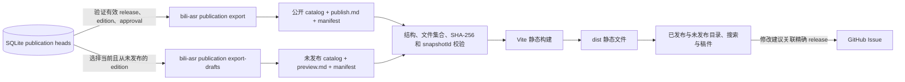

# Markdown 稿件阅读站

独立静态站点，展示主项目中正式发布的有效 release，以及明确标注审核状态的当前未发布编辑版本。
浏览器读取各自快照中的公开 Markdown 和读者元数据；SQLite、AI 合成稿、校验参照稿与内部事件留在主项目。

仓库初始保留两份合法空快照；本地联调使用的合成稿件不会作为正式内容提交。

## 架构



## 本地运行

需要 Node.js 20 或更新版本及 pnpm：

```powershell
pnpm install --frozen-lockfile
pnpm dev
```

默认地址为 `http://127.0.0.1:5173`。开发服务器启动及生产构建均校验两份公开快照。
仓库初始快照是合法空目录，查看未发布稿件不会产生审核或正式发布事实。

## 导入已发布稿

先在 `bilibili-asr-archive` 中按新稿件契约创建 edition、审核准确内容哈希并显式发布，然后导出：

```powershell
bili-asr publication export --archive-root C:\Archive\new-contract --out C:\Sites\markdown-reading-site\content
```

输出目录必须与源归档及产物根互不重叠。命令读取有效发布指针，只导出当前 release 的
`publish.md`；创建 B 草稿或批准未发布的 B 时，公开目录继续呈现 A。明确发布 B 后切换 B，
撤回当前版本后该分 P 从新快照中移除。审核与编辑命令详见主项目
[publication.md](https://github.com/SuperCatQR/bilibili-asr-archive/blob/main/docs/publication.md)。
后端契约实现与审核流程见 [主项目 PR #264](https://github.com/SuperCatQR/bilibili-asr-archive/pull/264)。

本仓库只接受新契约：

```text
content/
  catalog.json
  publication-export-manifest.json
  articles/part-<videoPartId>/publish.md
```

catalog 为 `{ "schemaVersion": 1, "manuscriptType": "publication", "articles": [...] }`。
每条记录冻结读者可见标题、摘要、标签、整理属性、编辑说明和来源，携带 edition/release/revision
标识、完整内容哈希、发布文件哈希、模板 `publish-v1` 与 Unix 秒发布时间。manifest 包含准确
受管文件集合、每个文件的 SHA-256 及快照身份；构建会核验 catalog 与 manifest 指向同一文章。
32 位十六进制 edition ID 与 64 位 SHA-256/release/revision ID 区分校验。

旧数组 catalog、旧 manifest、旧正文命名、任何 `reviews/` 内部目录、未登记或残留文件、
缺失文章、错误哈希、符号链接及路径逃逸都会拒绝。没有兼容转换或迁移路径。
原有旧快照保留在 Git 历史中，重新导出必须来自已明确获批和发布的新归档。

## 导入未发布稿件

在主项目中把当前且从未产生 release 的编辑版本导出到站点独立的 `draft-content/`：

```powershell
bili-asr publication export-drafts --archive-root C:\Archive\new-contract --out C:\Sites\markdown-reading-site\draft-content
```

该命令只读取稿件与审核状态，不批准或发布稿件。每个分 P 最多导出当前 edition；历史版本、
曾经发布的版本、已替换或撤回的 release 不会通过未发布入口重新公开。
已发布 A 与当前草稿 B 可以并存；审核 B 不会改变正式发布目录中的 A。
审核状态分别显示为“待审核”“审核中”“待修改”“未采用”“已审核 · 未发布”。

```text
draft-content/
  catalog.json
  publication-draft-export-manifest.json
  drafts/edition-<editionId>/preview.md
```

草稿 catalog 使用 `{ "schemaVersion": 1, "manuscriptType": "publication-draft", "articles": [...] }`。
每条记录冻结读者元数据和来源，携带 edition/revision 标识、内容哈希、预览文件哈希、审核状态与
Unix 秒创建时间；没有 release ID、发布时间或发布模板声明。manifest 类型为
`publication-draft-export`，对准确文件集合、SHA-256 与快照身份执行同样的严格验证。
已发布和未发布快照不可同时声明同一个 edition；内部 `editorial export` 包不能放入任一输入目录。

未发布正文也会进入公开站点的生产构建和部署文件。只导入已决定公开的读者预览内容；
模型配置、审核演员、审计事件、AI 合成稿、校验参照稿和补丁保持在独立内部审阅包中。

## 阅读与修改建议

“已发布”和“未发布”入口各自搜索标题、摘要、正文和标签，支持主题筛选与深浅主题。
发布稿读取完整的 `publish.md`，展示冻结视频来源、发布时间以及可展开的 release/edition/hash。
未发布稿读取完整的 `preview.md`，按 `?draft=<editionId>` 定位，展示创建时间、审核状态和准确
edition/hash，并提示“未经正式发布，信息待核验”。原始 HTML 被禁用，外链采用
`noopener noreferrer`。旧 `?review=` 内部审核路由仍返回未找到。

读者可以提交预填 GitHub Issue，描述修改建议并关联准确 edition 和内容哈希；正式发布稿还关联 release。
Issue 讨论不会自动改写文章或审核事实；维护者需在主项目中创建新 edition、审核及发布。
内部审阅包使用 `bili-asr editorial export` 单独导出，不能放入此站点内容目录。

## 构建与部署

```powershell
pnpm test
pnpm validate
pnpm build
```

本仓库包含 GitHub Pages 工作流；Pages 来源设为 GitHub Actions 后，推送 `main` 会构建并部署。
公开地址为 `https://supercatqr.github.io/markdown-reading-site/`。
导出的 `content/` 与 `draft-content/` 分别作为快照提交；编辑、正式发布、撤回或替换后重新导出两份
快照、构建和部署，确认托管端旧文件和 CDN
缓存清理。后端的本地快照更新不能撤销已部署副本。
