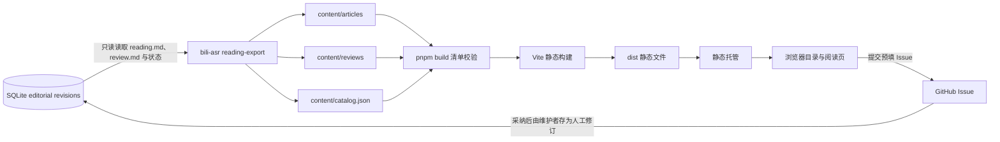

# Markdown 阅读稿

独立的静态阅读站，展示数据库中的待审稿与已发布稿。数据库由主项目的只读导入命令读取；浏览器只接收经过筛选的 Markdown 与元数据，不接触 SQLite、原始转录、凭据或本地媒体目录。

## 架构



## 本地运行

需要 Node.js 20 或更新版本，并启用 pnpm：

```powershell
pnpm install
pnpm dev
```

默认开发地址为 `http://127.0.0.1:5173`。

## 公开部署

该项目包含 GitHub Pages 工作流。将仓库的 Pages 来源设为 **GitHub Actions** 后，推送到 `main` 会自动构建和部署：

```text
https://supercatqr.github.io/markdown-reading-site/
```

站点是公开静态文件；导入的待审核正文、`review.md` 审核上下文、来源链接和质量状态都会公开显示。数据库导入仍然在本地执行，导入后的 `content/` 需要作为提交内容推送到仓库。

## 导入数据库稿件

在主项目根目录运行只读导入（`--issues-url` 可覆盖默认的 GitHub Issue 地址，也可通过 `BILI_READING_ISSUES_URL` 配置）：

```powershell
uv run bili-asr reading-export --archive-root archive --out reading-site/content
cd reading-site
pnpm build
```

命令读取 `archive/archive.db` 和登记的 `reading.md`、`review.md`，校验文档 SHA-256 后生成 `content/catalog.json`、`content/articles/*.md` 与 `content/reviews/*.md`。默认导入尚未被拒绝或撤回的修订；没有审核记录时标记为待审核。模型请求和原始转录不会导出。校验会拒绝未登记文件、越界路径、手工文件与内容哈希不一致。

## Issue 审核与修改

以下 `bili-asr` 命令均从主项目根目录运行：

每篇稿件的详情页可以切换阅读稿和公开审核稿，并提供预填的 Issue 链接。读者提交 Issue 后，将实际 Issue URL 和状态登记到数据库：

```powershell
uv run bili-asr reading-review <REVISION_ID> --status in-review --issue-url https://github.com/SuperCatQR/markdown-reading-site/issues/123
```

采纳 Issue 建议后，把修改完成的 Markdown 保存到文件并提交为不可变人工修订；这会让稿件重新进入待审核状态：

```powershell
uv run bili-asr reading-edit <REVISION_ID> --markdown-file .\accepted-reading.md --note "issue #123"
uv run bili-asr reading-review <REVISION_ID> --status approved --note "复核通过"
uv run bili-asr reading-review <REVISION_ID> --status published --note "发布"
uv run bili-asr reading-export --archive-root archive --out reading-site/content
```

`reading-edit` 不改写 AI 修订，而是保存新的人工作品版本、父版本 ID、内容哈希和时间；状态变更写入审核事件表。Issue 用于提出和讨论修改，采纳的正文通过 `reading-edit` 写回数据库。站点的 Issue 模板只负责收集意见，审核状态仍由维护者登记，重新导入后才会更新公开快照。

## 边界与功能

- 浏览器内渲染 Markdown，原始 HTML 被禁用；外链在新标签页打开。
- 目录支持标题、摘要、正文和标签搜索，按主题筛选，并提供深浅主题切换。
- `catalog.json` 与稿件 Markdown 是数据库导入器生成的站点快照；不要手工修改生成目录。
- 文章页会展示待审核、审核中、待修改、已通过或已发布状态，并链接到 Issue；有审核稿时提供独立审核稿视图。
- Issue 提交使用 GitHub 预填表单，不需要站点保存 GitHub 凭据；Issue 状态目前由维护者运行 CLI 登记，没有后台 webhook。
- 静态站点不提供访问控制。导入的待审正文和审核稿会随站点静态文件公开；部署前应确认稿件允许公开。

## 校验

```powershell
pnpm test
pnpm validate
pnpm build
```
