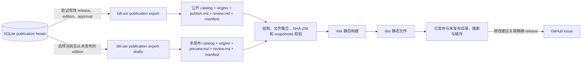

# Markdown 稿件阅读站

独立静态站点，展示主项目中正式发布的有效 release，以及明确标注审核状态的当前未发布编辑版本。
浏览器读取各自快照中的公开正文、AI 初稿的校验参照稿和读者元数据；SQLite、独立 AI 合成稿及内部事件留在主项目。

仓库初始保留两份合法空快照；本地联调使用的合成稿件不会作为正式内容提交。

## 产品定位与改动依据

项目面向长视频与系列讲解内容的学习者，提供可搜索、可连续阅读、可回看来源的文字资料库，服务阅读、查找、复习与核验。

后续功能、界面、内容组织和技术选型以 [项目哲学与产品原则](docs/product-philosophy.md) 为产品依据；仓库协作要求见 [AGENTS.md](AGENTS.md)。该文档记录长期目标与取舍，功能方向不代表已经实现；当前内容契约与运行方式以本 README 和代码为准。

## 架构



## 本地运行

需要 Node.js 20 或更新版本及 pnpm：

```powershell
pnpm install --frozen-lockfile
pnpm dev
```

默认地址为 `http://127.0.0.1:5173`。开发服务器启动及生产构建均校验两份公开快照。
当前生产快照为 0 篇已发布、1,228 篇未发布；查看未发布稿件不会产生审核或正式发布事实。

## 唯一内容契约与导入

本站只接受生产者显式导出的 `universal-origin-v1`：**catalog v3、content v2、source metadata v1、origins v1、manifest v2**。这些是独立版本。拒绝旧 catalog v1/v2、legacy article、混合新旧条目、publish-v1 和旧 manifest v1；不推断字段、不转换旧快照、不修改冻结 Markdown 或哈希。

上游契约固定于 [producer b584f6a](https://github.com/SuperCatQR/bilibili-asr-archive/blob/b584f6ac29b9e6acf598496c255ee73753063074/docs/preserved-body-import.md)。这是 PR #304 实现、PR #75/#77 已接入的来源交付策略，替代早期 issues #64/#68 提议的 manifest v1。导入步骤及来源说明见 [保留旧正文的迁移导入](docs/preserved-body-import.md)。

当前读取架构、#64–#68 修复映射、快照身份与验收/部署边界见 [通用契约修复交付](docs/universal-reader-delivery.md)。

桌面与窄屏的切换、导航层级和查找复测，以及 #80–#91 的逐项修复映射见 [阅读层级与切换修复](docs/desktop-reading-hierarchy-fixes.md)。最近阅读使用独立视图展示完整记录；目录保留最近一篇的快捷继续入口。单篇与连续阅读保留视频查询、查找方式和筛选范围，来源面板中的发布状态始终与冻结快照一致。

在主项目生成完整的新格式公开和草稿目录：

```powershell
bili-asr publication export --archive-root C:\Archive\new-contract --out C:\Sites\markdown-reading-site\content --contract-profile universal-origin-v1
bili-asr publication export-drafts --archive-root C:\Archive\new-contract --out C:\Sites\markdown-reading-site\draft-content --contract-profile universal-origin-v1
```

输出根须与归档和产物互不重叠。默认导出完整范围；上游遇到范围内旧条目会整体失败，不能静默过滤。显式 `--release-id` / `--edition-id` 或 `--empty-scope` 只用于确实要公开的选择范围，不能用空目录替代未完成的内容交付。

```text
content/
  catalog.json
  origins.json
  publication-export-manifest.json
  articles/part-<videoPartId>/publish.md
  articles/part-<videoPartId>/review.md
draft-content/
  catalog.json
  origins.json
  publication-draft-export-manifest.json
  drafts/edition-<editionId>/preview.md
  drafts/edition-<editionId>/review.md
```

两份 catalog 只有 `schemaVersion: 3`、`manuscriptType` 和 `articles`。类型分别为 `publication` / `publication-draft`；空目录仍有 v3 catalog、空 origins 和 v2 manifest。每篇都包含完整 contentVersion=2 来源与编辑字段；允许 null 的字段也必须存在，未知字段拒绝。

稿件编辑字段 `title/summary/tags/attribution/editorNote` 与冻结的 `sourceMetadata` 分开。来源有 `platform/externalVideoId/partIndex`，视频身份为平台和大小写敏感外部 ID 的元组，分段按零基 partIndex 排序。Bilibili 来源 URL 必须准确绑定视频与 P；YouTube 使用规范 watch URL，当前 partIndex=0。来源 metadata 的 17 个字段、文本/标签边界、规范 URL、UTC 发布时间派生及身份相等均校验。未知源视频发布时间保持 null，不用创建、导入或观察时间补充；封面只允许安全 HTTPS hdslb.com 子域，其他未知封面为 null。

reader 数值范围采用 JavaScript 安全整数子集。原始 JSON 数字必须为无小数、无指数的十进制安全整数，越界值在使用前拒绝，不能舍入后通过校验。producer 的 int64 范围更宽；导入前应按 reader 校验预检，越界快照无法构建。

公开记录使用准确 release/edition/AI revision、content/artifact/review 哈希、publish-v2 与 Unix 秒正式发布时间。草稿有 edition 创建时间与五种审核状态，禁止 release、发布模板及发布时间。edition 是 32 位小写十六进制，其余 SHA-256 身份是 64 位；videoPartId 为正安全整数。`contentSha256` 对应完整冻结内容对象，不能从 catalog 投影重算；artifact/review 哈希对应原始文件字节。

manifest v2 只有 schemaVersion、manuscriptType、contractProfile、snapshotId、files；类型分别为 publication-export / publication-draft-export。files 按路径排序，准确登记 catalog、origins、正文和参照，不登记自身。snapshotId 是包含版本、类型、profile 和 files 的 canonical JSON 的 SHA-256，不再使用旧 v1 的仅 files 算法。所有原始文件哈希、有效 UTF-8、重复 JSON key、文件集合、路径、符号链接和残留目录在开发/构建前验证；内部 review.json、数据库、actors、audit、模型响应、凭据及未知目录不能进入快照。

origins 每篇唯一绑定准确 edition、revision、内容和 sourceMetadata 哈希，并区分原生 ai-generated-v2、保留旧正文 preserved-legacy-body 与迁移后编辑 edited-after-preservation。PR #77 导入的 1,228 篇均未发布、待审核，其中 1,103 篇保留旧正文，125 篇为原生 v2；生产内容清单、实际快照身份与保留证据见 [生产迁移记录](docs/production-preserved-import-20261010.md)。迁移不等于重新生成、审核或发布，历史 AI 参照保持真实 ai-draft-v1。

公开只包含有效当前 release，草稿只包含当前且从未发布的 edition。公开 A 与同 part 的新草稿 B 可以并存；相同 edition 不得跨两目录。批准 B 不改变 A；明确发布 B 后更新公开目录，撤回版不通过草稿重新公开。参照是对应 AI revision 的原始基线，不能当作后来人工 edition 的批准凭据。

两类快照可包含生产者 `--series-file` 导出的 series.json，必须登记 manifest 并参与 snapshotId。系列 v1 仍是编辑确认的 Bilibili 系列；其 BVID 成员明确匹配新文章的 bilibili/externalVideoId，并绑定当前类别完整版本与 partIndex 顺序。构建拒绝陈旧、错类别、漏项、乱序和未登记关联；不从标题或标签推断系列，当前生产输入没有录入系列。

两份导出命令不天然原子。使用同一归档读取边界或确认期间发布状态无变化，成对全量验证并整体替换受管目录；有状态变化就重新导出。备份、暂存、锁和恢复 journal 放在输入目录之外。部署失败保留上一有效站点，回退整份代码、双快照和静态产物，不让新代码消费旧快照。

## 阅读与修改建议

首页默认展示“全部内容”，说明文字资料库的用途、视频与稿件数量，并按视频聚合分 P。
来源主题筛选、正文标签入口和元数据搜索全部使用冻结 sourceMetadata.tags，entry.tags 为稿件编辑字段，来源标签为空时不回退编辑标签。
“全部内容”“已发布”和“未发布”各自搜索标题、摘要、正文和源视频标签，支持标签筛选与深浅主题。
正式发布目录为空时，提供明确的公开预览入口；预览稿始终保留真实审核状态。
目录页页头提供“全部内容、主题、最近阅读”，发布状态通过筛选框切换。主题入口先展示 12 个常用源标签与不同视频数量，支持搜索全部源标签和分批展开；Escape 关闭并恢复焦点。
阅读页固定工具栏显示返回目标、视频标题与真实分 P 名称；“正文 / 校验参照”和“单篇 / 连续阅读”分别控制稿件视图与阅读方式。桌面左侧展示同视频目录；视频查找、参照查找、来源和导览在独立工具面板中打开，窄屏使用抽屉。关闭工具恢复正文段落与段内位置，切换工具不会叠加面板。宽桌面直接提供站点导航与深浅主题，其他宽度集中在“站点”。
视频范围链接明确包含 platform 和 video；连续模式额外包含 flow 与准确 edition。旧无平台视频 URL 和旧来源会话不迁移，文章/review 仍按 slug/edition 定位，已撤回或替换的旧 edition 没有自动映射。构建搜索分片以来源键摘要命名，外部 ID 不直接拼资产路径。
同一视频按分 P 数字顺序组织；同一分 P 的发布版与草稿分别显示。同视频目录和正文末尾提供同稿件类别的导航；可靠来源提供 partTitle 时显示该分段标题，未知时明确提示。连续阅读加载下一 P 后将正文定位到该篇；回滚已加载正文时同步更新当前 P 与分享地址。跳跃编号明确说明本站尚未收录的范围，不推断原视频缺失或跨视频系列。
若快照包含编辑确认的系列，阅读页另提供系列说明、完整确认顺序及前后视频入口。经确认缺失或本类别暂无稿件的相邻位置显示说明，不生成跨类别链接。

搜索结果展示命中上下文与关键词高亮；正文命中链接使用 URL fragment 定位相应段落，打开后
高亮命中词。目录不展示自动首段摘录，保留已有编辑摘要；来源链接可直接打开对应平台原视频。
目录分批显示视频。返回目录与浏览器后退会恢复关键词、标签、展开的分 P 列表、已显示数量和
滚动位置；同一标签页刷新后继续保留。该状态通过 history 与 sessionStorage 保存，存储禁用时
当前页面的内存状态仍支持往返。默认综合搜索将完整标题精确匹配置前，其余结果保持正文证据优先；输入查询后，可直接选择标题相关优先，无需展开高级查找。原句和全部关键词保持正文准入规则。结果默认显示一段短证据，其余命中按需展开；全部命中锚点保留。纯空白查询（含不换行空格）按空查询处理。查找方式和排序支持分享与恢复，当前生效方式及排序依据可见。加载索引期间移除旧结果，长等待可清空取消，失败可重新请求。

阅读排版提供 17/19/21px 字号、三档行距、620/760/920px 桌面行宽与宋体/黑体风格，手机宽度受屏幕限制。设置仅保存在当前浏览器，存储失败会明确提示；调整排版保持当前正文块及段内位置。正文有真实小标题时提供原文目录，没有时按原文正文块与摘录提供段落导览，不生成章节或改写快照。字体使用系统回退，不要求外部字体服务完成加载。实现依据与复测见 [访客体验修复说明](docs/visitor-experience-fixes.md)。

正文阅读位置独立保存到当前浏览器的 localStorage（reader-history-v2 / schemaVersion=2）；目录直接显示最近一篇的标题、P 和继续入口，其余记录、删除、清空与存储说明在次级管理区域。最多保留 20 篇，180 天后到期。记录绑定稿件类别、videoPartId、contentVersion、完整平台/外部 ID/partIndex、edition、正文内容及文件哈希，发布稿另绑定 release；使用段落锚点和段内相对位置恢复。连续阅读记录实际可见的 P，重开只请求该篇。内容更新时从新版开始，撤回时不恢复旧位置。校验参照不覆盖正文记录；显式链接锚点与页面历史优先，本地恢复由读者选择。打开查找或本文目录前保留正文位置，关闭、取消或返回可继续原处，工具滚动不覆盖进度；明确选择命中或主动回到正文阅读后恢复保存。存储不可用或记录损坏不阻止阅读，也不宣称保存成功；不提供跨设备同步。旧 reader-history-v1 不读取、不迁移，也不在初始化或新记录清空时自动删除。

构建插件先验证两份输入快照，再派生阅读时间与两类独立的 JSON 搜索索引。派生数据
不写入 `content/` 或 `draft-content/`。首页只加载目录元数据、阅读时间和文档 URL；首次输入搜索词时
加载对应正文索引；阅读页的视频内查找只加载当前视频与所选稿件类别的分片，不回退到全库下载。正文命中提供按真实 P 和段落顺序的上一处、下一处、序号、返回结果与结束查找，跨 P 绑定准确版本和完整查询。打开稿件时只请求当前 Markdown，校验参照独立按需请求。搜索索引不包含
校验参照。索引和文档带内容指纹，与静态托管的子路径部署兼容；加载失败提供重试入口。

全站搜索现在先请求与查询有关的二字符候选分区，再以最多 8 个并发请求加载候选视频的正文分片，最后执行完整精确搜索。单字或候选超过当前类别 60% 的宽泛查询使用完整索引；不减少搜索方式、正文证据或排序。空查询不加载索引，取消或改词停止旧队列，失败可重试。

搜索大标题进入按实际 P 和正文顺序的首个命中，传递完整查询、方式及类别；纯元数据匹配不虚构段落。命中操作菜单支持 Escape 与外部点击关闭。真正从全站列表进入的阅读可恢复原列表状态与位置，本视频命中另有独立入口；直接分享只提供重新搜索，不能恢复不存在的前序列表。最近阅读区的手机标题默认两行，可点击或用键盘展开完整标题，继续阅读与管理入口同行。

文章内的“正文 / 校验参照稿件”只切换当前编辑版本的视图，独立于页头的稿件分类。
从目录进入文章后，返回链接回到原目录；直接打开文章时回到其所属的已发布或未发布目录。
未找到页面不高亮任何分类。阅读页保留当前审核及发布状态，冻结的整理归属、编辑说明、完整版本与修改建议集中在按需打开的“来源与版本”面板，版本标识仅需展开一次，并说明
稿件处理状态不构成对视频中全部观点的学术认证。
发布稿读取完整的 `publish.md`，展示冻结视频来源、发布时间以及可展开的 release/edition/hash。
未发布稿读取完整的 `preview.md`，按 `?draft=<editionId>` 定位，展示创建时间、审核状态和准确
edition/hash，并提示“未经正式发布，信息待核验”。每篇稿件都提供“正文 / 校验参照稿件”入口，
`?review=<32位editionId>` 必须在两份 catalog 中唯一匹配，由其归属显示已发布或未发布分类。
未知标识、重复参数、同时指定 `review` 与 `read` / `draft` / `view` 都返回未找到。

校验参照是 `aiRevisionId` 对应的 AI 初稿基线，展示完整原文、整理稿、疑点、候选、依据及视频
回看链接。后续人工编辑可能改动正文；参照中的“未经人工复核”描述基线生成时的情况，
当前稿件审核状态另行显示。它不构成人工审核记录，也不因关联稿件获批或发布而重写。
“复制 Markdown”复制当前视图原始完整文件，校验参照版本详情显示原始文件 SHA-256。
目录搜索仍只搜索稿件正文与读者元数据。两类 Markdown 的原始 HTML 均被禁用，外链采用
`noopener noreferrer`。

读者可以提交预填 GitHub Issue，描述修改建议并关联准确 edition、AI 修订和内容哈希；正式发布稿还关联 release。
从校验参照发起的建议另带参照文件哈希和对应 `?review=` 链接。
阅读工具中的“核对”保留当前正文段落与阅读位置：仅在完整版本身份相同且参照整理稿文本唯一、完全匹配时定位；重复文本提供候选，编辑后无法匹配时提示参照内查找。返回正文保留原来的查询、锚点与连续阅读状态。
参照按段区分原文、整理稿与疑点，生成信息默认收起；未知模板完整展示，原始 Markdown 仍可查看、复制。顶部“查找”在参照视图中只搜索已加载的当前参照，支持上一处、下一处、展开隐藏命中及返回阅读处，不加入目录或视频正文索引。
“纠错 / 反馈这一段”打开站内反馈面板，可带入选中文本或当前段落，补充上下文、建议与理由；完整反馈包含段落链接、edition、AI 修订、内容及文件哈希，正式稿另含 release，参照有实际时间段与来源链接时一并附上。无需登录即可复制建议，实际 GitHub 提交需要登录。建议按完整版本与正文/参照分别暂存于 sessionStorage，最多保留 10 份，每项字段最多 4000 字符；会话结束后不保证保留，也不提供跨设备同步。存储与复制失败分别提供明确提示和手动复制文本；超过预填链接长度时要求复制粘贴，保留完整建议与版本证据。
Issue 讨论不会自动改写文章或审核事实；维护者需在主项目中创建新 edition、审核及发布。
内部审阅包使用 `bili-asr editorial export` 单独导出，不能放入此站点内容目录。

P0 的实现对应与浏览器复测方式见 [P0 阅读体验交付说明](docs/p0-reading-experience.md)。
本次开放 issues #39–#48 的实现、测量条件、阅读进度边界和回归依据见 [阅读体验修复交付说明](docs/issues-reading-improvements.md)。
后续 issues #51–#56 的评估、工具与进度保护、局部索引及进一步阅读排版见 [第二轮阅读体验修复](docs/followup-issues-reading.md)。#57、#59–#63 的系列契约、搜索上下文、候选索引及最近阅读布局见 [第三轮修复说明](docs/third-round-reader-fixes.md)；系列当前完成维护与消费契约，现有内容关联等待编辑确认。
贡献者 issues #70–#73 的实现、测量和边界见 [贡献者体验修复说明](docs/contributor-experience-fixes.md)。
目录直达正文、阅读页内分 P 切换与视频搜索、原句与多关键词反查及多个段落命中已实现，范围与复测方式见 [内容发现交付说明](docs/discovery-experience.md)。原独立视频总览已移除，旧链接兼容到阅读页。[内容反查与多分 P 阅读计划](docs/next-reading-features.md)中的连续阅读模式已实现，按类别逐篇加载、指定 P 分享与历史恢复的范围见 [连续阅读交付说明](docs/continuous-reading.md)。

## 构建与部署

```powershell
pnpm test
pnpm validate
pnpm build
```

本仓库包含 GitHub Pages 工作流；Pages 来源设为 GitHub Actions 后，推送 `main` 会构建并部署。
公开地址为 `https://supercatqr.github.io/markdown-reading-site/`。
导出的 `content/` 与 `draft-content/` 分别作为快照提交；编辑、正式发布、撤回或替换后重新导出两份
快照、构建和部署，确认托管端旧文件和 CDN
缓存清理。后端的本地快照更新不能撤销已部署副本。
