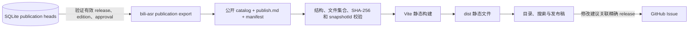

# Markdown 发布稿阅读站

独立静态站点，只展示主项目中经过精确版本审核并显式发布的有效 release。浏览器读取冻结的
公开 Markdown 和元数据；SQLite、AI 合成稿、校验参照稿、待审版本与内部事件留在主项目。

仓库当前保留合法的空公开快照；本地联调使用的合成发布稿不会作为正式内容提交。

## 架构



## 本地运行

需要 Node.js 20 或更新版本及 pnpm：

```powershell
pnpm install --frozen-lockfile
pnpm dev
```

默认地址为 `http://127.0.0.1:5173`。开发服务器启动及生产构建均校验公开快照。
仓库初始快照是合法空目录，不把原有待审稿自动批准为发布稿。

## 导入已发布稿

先在 `bilibili-asr-archive` 中按新稿件契约创建 edition、审核准确内容哈希并显式发布，然后导出：

```powershell
bili-asr publication export --archive-root C:\Archive\new-contract --out C:\Sites\markdown-reading-site\content
```

输出目录必须与源归档及产物根互不重叠。命令读取有效发布指针，只导出当前 release 的
`publish.md`；创建 B 草稿或批准未发布的 B 时，公开目录继续呈现 A。明确发布 B 后切换 B，
撤回当前版本后该分 P 从新快照中移除。审核与编辑命令详见主项目
[publication.md](https://github.com/SuperCatQR/bilibili-asr-archive/blob/main/docs/publication.md)。

本仓库只接受新契约：

```text
content/
  catalog.json
  publication-export-manifest.json
  articles/part-<videoPartId>/publish.md
```

catalog 为 `{ "schemaVersion": 1, "manuscriptType": "publication", "articles": [...] }`。
每条记录冻结读者可见标题、摘要、标签、整理属性、编辑说明和来源，携带 edition/release/revision
标识、完整内容哈希、发布文件哈希、模板 `publish-v1` 与 Unix 秒发布时间。manifest 包含准确
受管文件集合、每个文件的 SHA-256 及快照身份；构建会核验 catalog 与 manifest 指向同一文章。
32 位十六进制 edition ID 与 64 位 SHA-256/release/revision ID 区分校验。

旧数组 catalog、旧 manifest、旧正文命名、任何 `reviews/` 内部目录、未登记或残留文件、
缺失文章、错误哈希、符号链接及路径逃逸都会拒绝。没有兼容转换或迁移路径。
原有旧快照保留在 Git 历史中，重新导出必须来自已明确获批和发布的新归档。

## 阅读与修改建议

目录搜索范围是有效 release 的标题、摘要、正文和标签，支持主题筛选与深浅主题。
文章读取完整的 `publish.md`，展示冻结视频来源、发布时间以及可展开的 release/edition/hash。
原始 HTML 被禁用，外链采用 `noopener noreferrer`。公开页没有审核稿视图或草稿审核状态；
旧 `?review=` 路由返回未找到。

读者可以提交预填 GitHub Issue，描述修改建议并关联准确 release、edition 和内容哈希。
Issue 讨论不会自动改写文章或审核事实；维护者需在主项目中创建新 edition、审核及发布。
内部审阅包使用 `bili-asr editorial export` 单独导出，不能放入此站点内容目录。

## 构建与部署

```powershell
pnpm test
pnpm validate
pnpm build
```

本仓库包含 GitHub Pages 工作流；Pages 来源设为 GitHub Actions 后，推送 `main` 会构建并部署。
公开地址为 `https://supercatqr.github.io/markdown-reading-site/`。
导出的 `content/` 作为快照提交；撤回或替换后重新导出、构建和部署，确认托管端旧文件和 CDN
缓存清理。后端的本地快照更新不能撤销已部署副本。
